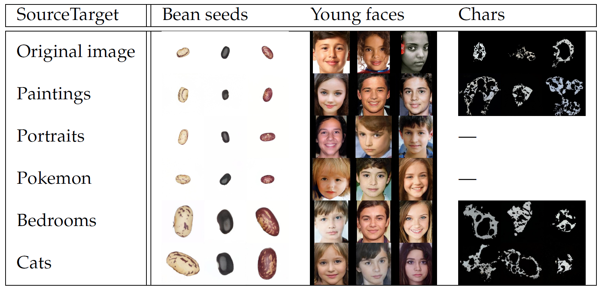

# StyleGAN data augmentation with transfer learning in industrial applications

**Picture:** *Generated target images from the source pre-trained domains.*

## Paper
> **StyleGANs and transfer learning for generating synthetic images in industrial applications**
> 
> Harold Achicanoy, Deisy Chavez, and Maria Trujillo
> 
> **Abstract:** *Deep learning applications on computer vision involve the use of a large volume and representative data to obtain state-of-art results due to the massive number of parameters to optimise in deep models.  However, data is limited with asymmetric distributions in industrial applications due to rare cases, legal restrictions, and high image acquisition costs. Data augmentation based on deep learning generative adversarial networks, such as StyleGAN, has been arise as a way to create training data with symmetric distributions that may improve the generalisation capability of the built models. StyleGAN generates highly realistic images  in a variety of domains as a data aumentation strategy but requires a large amount of data to build image generators. Thus, transfer learning in conjunction with generative models has been used to build models with small datasets.  However, there are not reports on the impact of pre-trained generative models using transfer learning. In this paper, we evaluate a StyleGAN generative model with transfer learning on different application domains ---training with paintings, portraits, pokemon, bedrooms, and cats--- to generate target images with different levels of content variability ---bean seeds (low variability), faces of subjects between 5 and 19 years (medium variability), charcoal (high variability). We used the first version of StyleGAN due to the large number of publicly available pre-trained models. The Fréchet Inception Distance was used for evaluating the quality of synthetic images.  We found that StyleGAN with transfer learning produced good quality images being an alternative for generating realistic synthetic images in the evaluated domains.*

## System requirements

GPU used:
- NVIDIA TITAN Xp 11 GB

Software:
- Operative System: Ubuntu 18.04
- TensorFlow 1.13.1
- CUDA 10.1
- NVIDIA driver version 435.21
- cuDNN 7.6.3
- The official code implementation from: https://github.com/NVlabs/stylegan

## Code/Use instructions
